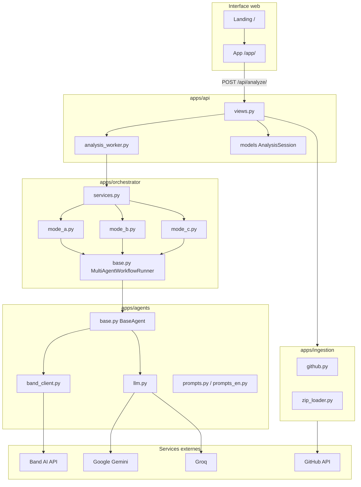
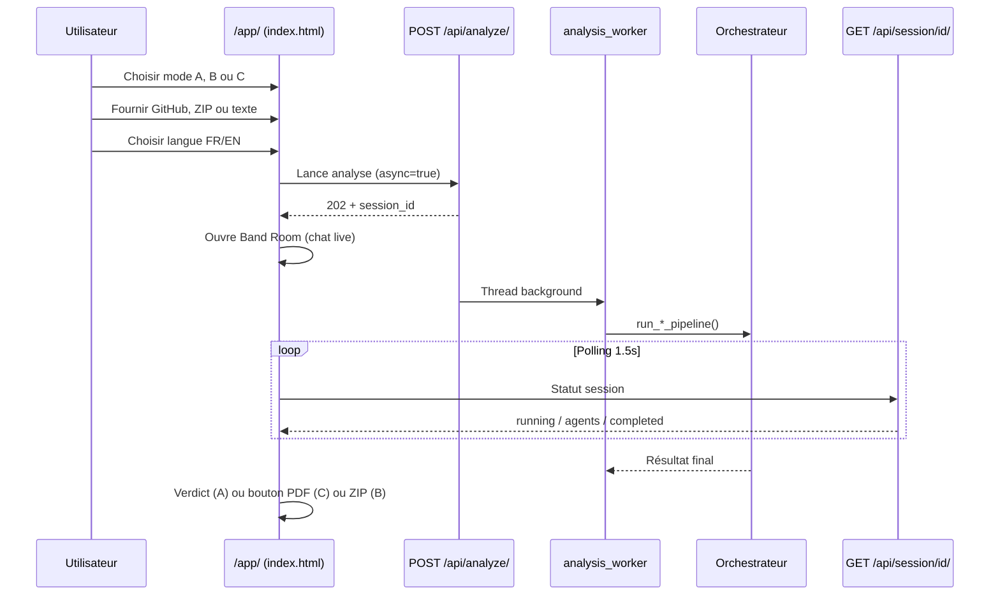
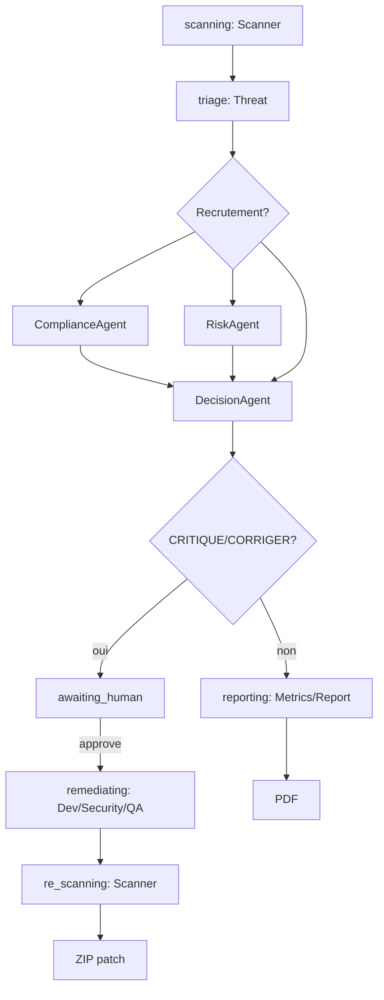

# SecureFlow AI — Fonctionnement complet (A à Z)

> **Projet** : plateforme multi-agents pour auditer, concevoir et sécuriser des projets logiciels.  
> **Contexte** : hackathon **Band of Agents 2026** (`BANDHACK26`).  
> **Principe** : une équipe d’agents IA spécialisés collabore en temps réel dans une **Band Room** (Band AI), chacun avec son propre compte Remote Agent.

---

## Table des matières

1. [Vue d’ensemble](#1-vue-densemble)
2. [Stack technique](#2-stack-technique)
3. [Architecture du projet](#3-architecture-du-projet)
4. [Les trois modes d’analyse](#4-les-trois-modes-danalyse)
5. [Les 16 agents IA](#5-les-16-agents-ia)
6. [Parcours utilisateur de bout en bout](#6-parcours-utilisateur-de-bout-en-bout)
7. [Ingestion des projets](#7-ingestion-des-projets)
8. [Orchestration multi-agents](#8-orchestration-multi-agents)
9. [Intégration Band AI (Band Room)](#9-intégration-band-ai-band-room)
10. [Couche LLM (Gemini / Groq)](#10-couche-llm-gemini--groq)
11. [API REST](#11-api-rest)
12. [Interface web](#12-interface-web)
13. [Internationalisation et thème](#13-internationalisation-et-thème)
14. [Livrables (verdict, ZIP, PDF)](#14-livrables-verdict-zip-pdf)
15. [Configuration (.env)](#15-configuration-env)
16. [Structure des dossiers](#16-structure-des-dossiers)
17. [Commandes utiles](#17-commandes-utiles)
18. [Déploiement](#18-déploiement)

---

## 1. Vue d’ensemble

SecureFlow AI répond à un problème concret : **aller vite sur la sécurité et la conception logicielle sans sacrifier la rigueur**.

Au lieu d’un seul chatbot générique, la plateforme enchaîne des agents avec des rôles précis :

| Rôle | Exemple d’agent |
|------|-----------------|
| Cartographier le code | ScannerAgent |
| Confirmer les menaces | ThreatAgent |
| Vérifier la conformité | ComplianceAgent |
| Décider (GO/NO-GO) | DecisionAgent |
| Concevoir l’architecture | ArchitectAgent |
| Générer le code | DevAgent |
| Produire un rapport PDF | ReportAgent |

Chaque agent :

1. Reçoit le **contexte cumulé** des agents précédents.
2. Appelle un **LLM** (Google Gemini par défaut, Groq en repli).
3. Publie sa réponse dans la **Band Room** avec une @mention vers l’agent suivant.

L’utilisateur suit la collaboration en direct dans l’interface **Band Room**, puis récupère le livrable selon le mode choisi.

---

## 2. Stack technique

### 2.1 Backend

| Technologie | Version / détail | Rôle |
|-------------|-------------------|------|
| **Python** | 3.11+ recommandé | Langage principal |
| **Django** | 5.x (`requirements.txt`) | Framework web, ORM, admin, templates |
| **SQLite** | Intégré | Base de données (sessions d’analyse) |
| **Gunicorn** | ≥ 21.2 | Serveur WSGI en production |
| **python-dotenv** | ≥ 1.0 | Chargement du fichier `.env` |
| **django-cors-headers** | ≥ 4.3 | CORS pour déploiement avec frontend séparé |
| **requests** | ≥ 2.31 | Appels HTTP (GitHub, Band AI, AI/ML API) |

### 2.2 Frontend

| Technologie | Rôle |
|-------------|------|
| **Templates Django** | Pages HTML (`landing.html`, `index.html`) |
| **JavaScript vanilla** | Band Room live, polling API, i18n, thème |
| **CSS custom + variables** | Thème clair/sombre (`static/css/theme.css`) |
| **Tabler Icons** (CDN) | Icônes UI |

> Pas de React, Vue ou Next.js : l’UI est volontairement légère et intégrée à Django.

### 2.3 Intelligence artificielle

| Provider | Package | Usage |
|----------|---------|-------|
| **Google Gemini** | `google-generativeai` | Provider LLM **par défaut** (`LLM_PROVIDER=google`) |
| **Groq** | `groq` | Repli automatique si quota Gemini ; chaîne de modèles et clés |
| **AI/ML API** | `requests` | Optionnel, désactivé par défaut |

Fichier central : `apps/agents/llm.py` — gestion des providers, fallbacks, rate limits.

### 2.4 Collaboration multi-agents

| Technologie | Rôle |
|-------------|------|
| **Band AI Remote Agents** | 13 identités distinctes (1 par rôle agent) |
| **Band Room API** | Salles de chat, participants, @mentions, contexte |

Client : `apps/agents/band_client.py`  
Registre des agents : `apps/agents/band_registry.py`

### 2.5 Génération de documents

| Technologie | Rôle |
|-------------|------|
| **ReportLab** | PDF professionnel Mode C (`apps/api/pdf_generator.py`) |
| **ZIP (stdlib)** | Archive projet Mode B (`apps/api/project_bundle.py`) |

### 2.6 Tests

| Outil | Emplacement |
|-------|-------------|
| **pytest** + **pytest-django** | `apps/core/tests/`, `apps/agents/tests/`, `apps/api/tests/` |
| Scripts manuels | `scripts/test_mode_a.py`, `scripts/test_api_backend.py` |

---

## 3. Architecture du projet

### 3.1 Schéma global



### 3.2 Applications Django

| App | Responsabilité |
|-----|----------------|
| `apps.core` | Locale, validation config, format sorties agents, contexte pipeline, troncature texte |
| `apps.agents` | Classes agents, prompts, client LLM, client Band |
| `apps.orchestrator` | Enchaînement séquentiel des agents, construction du contexte équipe |
| `apps.ingestion` | Import GitHub, ZIP, métadonnées de couverture |
| `apps.api` | Endpoints REST, modèle session, worker async, PDF, ZIP |

### 3.3 Routes principales

| URL | Fichier | Description |
|-----|---------|-------------|
| `/` | `templates/landing.html` | Page d’accueil marketing |
| `/app/` | `templates/index.html` | Plateforme d’analyse |
| `/api/*` | `apps/api/urls.py` | API REST |
| `/admin/` | Django Admin | Gestion des sessions |

---

## 4. Les trois modes d’analyse

SecureFlow propose un **produit principal Audit-to-Fix (Mode A)** plus deux modes legacy (B greenfield, C PDF seul).

### 4.1 Mode A — Audit-to-Fix (produit principal)

| Propriété | Valeur |
|-----------|--------|
| **Objectif** | Auditer RGPD/OWASP, décider GO/NO-GO, remédier sous supervision humaine |
| **Orchestrateur** | `AuditToFixOrchestrator` (`apps/orchestrator/audit_to_fix.py`) |
| **Entrées** | Code collé, lien GitHub ou archive ZIP |
| **Limite fichiers** | 15 (`INGESTION_MAX_FILES_A`) |
| **Band** | Source de vérité LLM (`get_context`) ; recrutement dynamique |
| **Phases** | `scanning` → `triage` → `decision` → branche |
| **Branche remédiation** | CRITIQUE/CORRIGER → `awaiting_human` → Dev/Security/QA → re-scan → **ZIP patch** |
| **Branche reporting** | PROPRE/SURVEILLER → Metrics/Report → **PDF** |
| **Verdict UI** | Score /10 + checklist Fix now |

**Recrutement conditionnel dans Band** (pas au démarrage) :
- **ComplianceAgent** — PII/RGPD ou score menace > 6
- **RiskAgent** — paiement/PCI ou score > 5
- **DecisionAgent** — après triage
- **Dev/Security/QA** — après validation humaine (remédiation)
- **Metrics/Report** — branche propre

**Escalades** : second Scanner si ≥2 P1 ou RE-SCAN ; event `post_disagreement` si écart ≥3 pts entre agents.

**Décisions** : `CRITIQUE`, `CORRIGER`, `SURVEILLER`, `PROPRE`.

### 4.2 Mode B — Full Dev Pipeline (greenfield)

| Propriété | Valeur |
|-----------|--------|
| **Objectif** | Concevoir et générer un projet **from scratch** |
| **Agents** | 6 : Faisabilité → Architecte → Design → Dev → Sécurité → QA |
| **Entrée** | **Description textuelle uniquement** (brief projet) |
| **GitHub / ZIP** | Interdits |
| **Livrable** | Archive **ZIP** (code + README extrait du DevAgent) |
| **PDF** | Non |

### 4.3 Mode C — Rapport PDF (audit formel)

| Propriété | Valeur |
|-----------|--------|
| **Objectif** | Audit approfondi + livrable client/auditeur |
| **Agents** | 5 : Scanner → Threat → Compliance → Metrics → Report |
| **Entrées** | GitHub ou ZIP **obligatoires** (pas de simple extrait texte) |
| **Limite fichiers** | 50 (`INGESTION_MAX_FILES_C`) |
| **Profondeur prompts** | Approfondie (`DEEP`) |
| **Livrable** | **PDF ReportLab** (score /100, rapport, annexe métriques) |

### 4.4 Tableau comparatif

| Critère | Mode A | Mode B | Mode C |
|---------|--------|--------|--------|
| Cible | Code existant | Nouveau projet | Dépôt complet |
| Entrée | text / github / zip | text only | github / zip |
| Nombre d’agents | 3 | 6 | 5 |
| Vitesse | Rapide | Long (génération code) | Long (audit profond) |
| Sortie principale | Verdict live | ZIP | PDF |
| Score | Risque /10 | Validation QA | Sécurité /100 |

---

## 5. Les 16 agents IA

La plateforme référence **16 identités d’agents** dans l’UI ; **13 comptes Band** sont configurés dans `.env` (certains rôles partagent la même infrastructure Band).

### 5.1 Agents Audit-to-Fix (recrutement dynamique)

| Agent | Rôle | Recruté quand |
|-------|------|---------------|
| **ScannerAgent** | Cartographie + re-scan post-remédiation | Toujours (lead) |
| **ThreatAgent** | Menaces confirmées + metadata JSON | Après Scanner |
| **ComplianceAgent** | Conformité RGPD/OWASP | PII ou score > 6 |
| **RiskAgent** | Risque global / PCI | Paiement ou score > 5 |
| **DecisionAgent** | Verdict GO/NO-GO + arbitrage désaccord | Après triage |
| **DevAgent** | Patch fichiers (`=== FILE: ===`) | Remédiation approuvée |
| **SecurityAgent** | Audit du patch | Remédiation |
| **QAAgent** | Validation textuelle du patch | Remédiation |
| **MetricsAgent** | Score /100 | Branche reporting |
| **ReportAgent** | Rapport PDF | Branche reporting |

### 5.2 Agents Mode B (6)

| Agent | Rôle |
|-------|------|
| **FeasibilityAgent** | Faisabilité du brief |
| **ArchitectAgent** | Architecture technique |
| **DesignAgent** | UX / parcours utilisateur |
| **DevAgent** | Génération du code et structure projet |
| **SecurityAgent** | Audit du code généré |
| **QAAgent** | Validation qualité (VALIDÉ / REJETÉ / AVEC RÉSERVES) |

### 5.3 Agents Mode C (5)

| Agent | Rôle |
|-------|------|
| **ScannerAgent** | Scan approfondi du dépôt |
| **ThreatAgent** | Analyse des menaces confirmées |
| **ComplianceAgent** | Conformité OWASP / RGPD / bonnes pratiques |
| **MetricsAgent** | Métriques de sécurité /100 |
| **ReportAgent** | Rédaction du rapport final structuré |

### 5.4 Variables Band (.env)

Chaque agent Band utilise un **slug** (ex. `SCANNER`, `THREAT`, `DECISION`) :

```
BAND_{SLUG}_AGENT_ID=
BAND_{SLUG}_API_KEY=
BAND_{SLUG}_HANDLE=   # optionnel
```

Slugs complets : `SCANNER`, `THREAT`, `COMPLIANCE`, `RISK`, `DECISION`, `FEASIBILITY`, `ARCHITECT`, `DESIGN`, `DEV`, `SECURITY`, `QA`, `METRICS`, `REPORT`.

Guide détaillé : `docs/SETUP_BAND_13_AGENTS.md`.

---

## 6. Parcours utilisateur de bout en bout

### 6.1 Étapes dans l’interface



### 6.2 Flux technique interne

1. **Réception** — `apps/api/views.py` : validation mode, type d’entrée, locale.
2. **Ingestion** — GitHub / ZIP / texte → contenu concaténé + métadonnées (`files_analyzed`, `truncated`).
3. **Préparation** — Mode B : préambule « greenfield » ; autres modes : contenu brut.
4. **Validation runtime** — `check_runtime_config()` : clés LLM + agents Band requis pour le mode.
5. **Session DB** — `AnalysisSession` créée (`status=pending`, puis `running`, puis `completed`).
6. **Orchestration** — voir section 8.
7. **Résultat** — JSON stocké dans `result_json` ; UI poll `/api/session/<id>/`.
8. **Téléchargement** — `/api/pdf/<room_id>/` (C) ou `/api/zip/<room_id>/` (B).

---

## 7. Ingestion des projets

Module : `apps/ingestion/`

### 7.1 GitHub (`github.py`)

- Parse l’URL du dépôt (`owner/repo`).
- Récupère l’arborescence via l’API GitHub (token optionnel `GITHUB_TOKEN` pour éviter les rate limits).
- Filtre : extensions code, exclusion de `node_modules`, `.git`, `venv`, etc. (`INGESTION_IGNORE_DIRS` dans `settings.py`).
- Concatène les fichiers sélectionnés avec en-têtes de chemin.
- Limite : `INGESTION_MAX_FILES_A` ou `_C` selon le mode.

### 7.2 ZIP (`zip_loader.py`)

- Upload multipart (max 20 Mo).
- Protection **zip-slip** (chemins relatifs dangereux rejetés).
- Même logique de filtrage et limite de fichiers.

### 7.3 Texte collé

- Utilisé en Mode A (optionnel) et Mode B (obligatoire).
- Retourne un `IngestionResult` sans limite multi-fichiers.

### 7.4 Objet `IngestionResult`

```python
# apps/ingestion/types.py
content: str           # Texte envoyé aux agents
files_analyzed: int    # Fichiers effectivement lus
files_total: int       # Fichiers détectés dans le dépôt
truncated: bool        # True si limite atteinte
source_label: str      # ex. "github:owner/repo"
```

---

## 8. Orchestration multi-agents

Classe principale Mode A : `AuditToFixOrchestrator` (`apps/orchestrator/audit_to_fix.py`).  
Classe générique legacy : `MultiAgentWorkflowRunner` (`apps/orchestrator/base.py`) pour modes B/C.

### 8.1 Phases Audit-to-Fix



### 8.2 Band-first (source de vérité)

1. **Seed** — contenu projet en events `task` (chunks ~6000 car.).
2. **Lecture** — `get_context(room_id)` avant chaque LLM.
3. **Recrutement** — `post_recruitment()` + `add_participant()` quand la situation l'exige.
4. **Désaccord** — `post_disagreement()` si écart de scores ≥ 3.
5. **Humain** — `post_human_review_request()` (message Band avec @mention) après Decision CRITIQUE/CORRIGER ; l'opérateur répond **APPROUVE** ou **REJETE** dans le fil Band ; `start_band_human_poll()` reprend le pipeline ; l'UI web propose un raccourci (`POST /api/session/<id>/human-review/`) qui poste aussi dans Band.
6. **Fallback Python** — uniquement si historique Band vide.

### 8.3 Contexte pipeline (thread-safe)

`apps/core/pipeline_context.py` : `workflow_mode`, `locale`, `ingestion_meta`, `disagreement`, `pipeline_phase`.

### 8.4 Points d'entrée métier

| Fonction | Fichier | Mode |
|----------|---------|------|
| `run_security_audit()` → AuditToFix | `apps/orchestrator/services.py` | A |
| `run_dev_pipeline()` | idem | B |
| `run_report_pipeline()` | idem | C |

## 9. Intégration Band AI (Band Room)

### 9.1 Cycle de vie d’une Room

1. **Création** — Le premier agent du pipeline crée la Room (`POST /api/v1/agent/chats`).
2. **Participants** — Chaque agent suivant est ajouté avec son `agent_id`.
3. **Seed** — Contenu initial publié en plusieurs events `task` (chunks ~6000 car.).
4. **Messages agents** — Chaque agent lit `get_context()`, publie sa sortie via `post_message()` avec @mention du suivant (recrutement, désaccord, brief remédiation inclus).
5. **Escalades / validation** — Messages visibles dans le fil Band (`post_recruitment`, `post_disagreement`, `post_human_review_request`, `post_human_decision`) ; pas de coordination cachée côté Python seul.
6. **Contexte** — GET .../context = source de vérité LLM ; fil live UI + lien Band Room (and_room_url).

### 9.2 Client Band

Fichier : `apps/agents/band_client.py`

| Méthode | Action |
|---------|--------|
| `create_room()` | Nouvelle salle |
| `add_participant()` | Ajout agent |
| `seed_room()` | Dépôt initial du projet (multi-parties) |
| `post_agent_output()` | Message + mention |
| `post_escalation()` | Escalade non linéaire (ex. Threat → Scanner) |
| `post_human_review_request()` | Demande validation humaine dans Band |
| `post_human_decision()` | Décision humaine (proceed / abort) |
| `get_context()` | Historique messages |
| `format_context_as_text()` | Texte pour prompt LLM |

### 9.3 Affichage UI

Le frontend (`templates/index.html`) :

- Simule intros agents (« Starting the project security mapping… »).
- Affiche indicateur « is typing ».
- Joue les résumés agent par agent (polling `/api/session/<id>/`).
- Affiche les passations (« Scanner hands off to Threat »).

Les messages techniques internes (quota LLM, troncature) **ne sont pas** affichés à l’utilisateur (journalisés côté serveur uniquement).

---

## 10. Couche LLM (Gemini / Groq)

Fichier : `apps/agents/llm.py`

### 10.1 Sélection du provider

| Variable | Défaut | Description |
|----------|--------|-------------|
| `LLM_PROVIDER` | `google` | Provider global (Gemini) |
| `LLM_FALLBACK_PROVIDER` | auto | Repli si quota (ex. google → groq) |
| `LLM_METRICS_USE_AIMLAPI` | `true` | MetricsAgent → AI/ML API si `AIMLAPI_API_KEY` |
| `LLM_DEV_USE_FEATHERLESS` | `true` | DevAgent → Featherless si `FEATHERLESS_API_KEY` |

**Routage par agent** (`get_llm_client_for_agent()` dans `apps/agents/llm.py`) :
- **MetricsAgent** → `AimlApiLLMClient` (partenaire AI/ML API)
- **DevAgent** → `FeatherlessLLMClient` (partenaire Featherless, modèles open-source)
- **Autres agents** → provider global + repli Gemini/Groq

### 10.2 Chaîne Groq

- Plusieurs clés : `GROQ_API_KEY`, `GROQ_API_KEY_2`, `GROQ_API_KEYS`.
- Plusieurs modèles : `GROQ_MODEL` + `GROQ_MODEL_FALLBACKS`.
- Bascule automatique en cas de 429 / quota.

### 10.3 Prompts agents

| Fichier | Langue | Contenu |
|---------|--------|---------|
| `apps/agents/prompts.py` | FR | Prompts système + variantes mode A (FAST) / C (DEEP) |
| `apps/agents/prompts_en.py` | EN | Équivalent anglais |

Sélection : `get_prompt(agent_name, mode, locale)` dans `prompts.py`.

### 10.4 Format de sortie imposé

`apps/core/agent_output.py` définit des **préfixes obligatoires** par agent, ex. :

- FR : `SCAN TERMINÉ :`, `MENACES IDENTIFIÉES :`, `DÉCISION FINALE :`
- EN : `SCAN COMPLETE:`, `THREATS IDENTIFIED:`, `FINAL DECISION:`

Si le LLM ne respecte pas le préfixe, un **second appel** corrige la réponse.

Metadata structurée (JSON) en fin de rapport Decision / Report :

```
=== METADATA JSON ===
{ "decision": "CRITIQUE", "risk_score": 7.5, "audit_id": "SF-AUDIT-..." }
=== END METADATA ===
```

---

## 11. API REST

Base : `/api/` (`apps/api/urls.py`)

### 11.1 Endpoints principaux

| Méthode | Route | Description |
|---------|-------|-------------|
| `POST` | `/api/analyze/` | Lance une analyse (JSON ou multipart ZIP) |
| `POST` | `/api/session/<id>/human-review/` | Validation humaine Mode A (`proceed` / `abort`) |
| `GET` | `/api/room/<room_id>/messages/` | Messages Band agrégés |
| `GET` | `/api/pdf/<room_id>/` | Téléchargement PDF (Mode C uniquement) |
| `GET` | `/api/zip/<room_id>/` | Téléchargement ZIP (Mode B uniquement) |
| `GET` | `/api/health/` | Health check |

### 11.2 Corps POST `/api/analyze/` (JSON)

```json
{
  "mode": "A",
  "input_type": "github",
  "github_url": "https://github.com/owner/repo",
  "locale": "en",
  "async": true
}
```

| Champ | Description |
|-------|-------------|
| `mode` | `A`, `B` ou `C` |
| `input_type` | `text`, `github`, `zip` |
| `content` | Code ou brief (text) |
| `github_url` | URL dépôt |
| `locale` | `fr` ou `en` |
| `async` | `true` → réponse 202 + polling session |

### 11.3 Modèle de session

`AnalysisSession` (`apps/api/models.py`) :

| Champ | Rôle |
|-------|------|
| `mode` | A / B / C |
| `room_id` | ID Band Room |
| `status` | pending / running / **awaiting_human** / completed / failed |
| `result_json` | Agents, decision, audit_id, locale, ingestion… |
| `final_report` | Texte du dernier agent |
| `duration_seconds` | Durée totale |

### 11.4 Worker asynchrone

`apps/api/analysis_worker.py` :

- Thread daemon par analyse.
- Met à jour `room_id` et `result_json` via callbacks `on_room_created`, `on_progress`.
- **Mode A** : si validation humaine requise, session passe en `awaiting_human` ; reprise via réponse **APPROUVE/REJETE** dans Band (`start_band_human_poll`) ou raccourci web `POST /api/session/<id>/human-review/` (poste `post_human_decision` dans Band puis reprend).
- En cas d’échec : message utilisateur générique (sans détail technique quota).

---

## 12. Interface web

### 12.1 Pages

| Page | URL | Fichier |
|------|-----|---------|
| Accueil | `/` | `templates/landing.html` |
| Plateforme | `/app/` | `templates/index.html` |

### 12.2 Page plateforme (`/app/`)

1. **Sélection du mode** — 3 cartes (A / B / C).
2. **Équipe d’agents** — Chips du pipeline (lecture seule).
3. **Formulaire** — GitHub, ZIP ou zone texte selon le mode.
4. **Band Room** — Fil Band live (poll `/api/room/<id>/messages/`) + bouton « Ouvrir dans Band ».
5. **Validation humaine (Mode A)** — Quand `status=awaiting_human`, l'opérateur répond **APPROUVE** ou **REJETE** dans Band (prioritaire) ; raccourcis web postent aussi dans Band avant reprise.
6. **Livrables** — Carte verdict (A), bouton PDF (C), bouton ZIP (B).

### 12.3 Fichiers statiques

| Fichier | Rôle |
|---------|------|
| `static/css/theme.css` | Variables CSS thème clair/sombre |
| `static/js/theme.js` | Toggle thème (`secureflow-theme`) |
| `static/js/i18n.js` | Traductions FR/EN (`secureflow-locale`) |

Partials : `templates/partials/theme_head.html`, `theme_toggle.html`, `i18n_head.html`, `lang_toggle.html`.

---

## 13. Internationalisation et thème

### 13.1 Langues supportées

| Couche | Mécanisme |
|--------|-----------|
| **UI** | `static/js/i18n.js` + attributs `data-i18n` dans les templates |
| **API** | Paramètre `locale` ; messages via `apps/core/locale.py` |
| **Agents LLM** | Prompts FR/EN + consignes « respond in English » si `locale=en` |
| **PDF Mode C** | Libellés couverture via `pdf_message()` dans `locale.py` |

### 13.2 Thème clair / sombre

- Attribut HTML : `data-theme="dark"` ou `data-theme="light"`.
- Persistance : `localStorage` clé `secureflow-theme`.
- Anti-flash : script inline dans `theme_head.html` avant le rendu.

---

## 14. Livrables (verdict, ZIP, PDF)

### 14.1 Mode A — Verdict

Affiché dans la Band Room (`showModeADecisionCard` dans `index.html`) :

- Badge décision coloré
- Score de risque /10
- Checklist « Fix now » extraite du DecisionAgent
- ID audit (`SF-AUDIT-YYYYMMDD-XXXX`)

### 14.2 Mode B — ZIP

- Extraction des blocs de code du **DevAgent** (`apps/api/project_bundle.py`).
- Structure : fichiers + README si présent.
- Téléchargement : `GET /api/zip/<room_id>/`.

### 14.3 Mode C — PDF

Généré par `generate_mode_c_pdf()` (`apps/api/pdf_generator.py`) :

| Section | Contenu |
|---------|---------|
| Couverture | SecureFlow AI, titre localisé, score /100 |
| Métadonnées | Nom rapport (`SecureFlow Analysis {audit_id}`), ID, date, décision |
| Rapport | Contenu ReportAgent |
| Annexe | Métriques MetricsAgent (si présentes) |

Nom affiché : **`SecureFlow Analysis SF-REPORT-…`** (EN) ou **`SecureFlow Analyse SF-REPORT-…`** (FR).

---

## 15. Configuration (.env)

Modèle complet : `.env.example`

### 15.1 Django / serveur

```
DJANGO_SECRET_KEY=
DJANGO_DEBUG=True
ALLOWED_HOSTS=localhost,127.0.0.1
CORS_ALLOW_ALL_ORIGINS=False
```

### 15.2 Band AI (×13 agents)

```
BAND_BASE_URL=https://app.band.ai
BAND_SCANNER_AGENT_ID=
BAND_SCANNER_API_KEY=
# … répéter pour chaque slug …
```

### 15.3 LLM

```
LLM_PROVIDER=google
GOOGLE_API_KEY=
GOOGLE_MODEL=gemini-2.0-flash
GROQ_API_KEY=
GROQ_MODEL=llama-3.1-8b-instant
GROQ_MODEL_FALLBACKS=llama-3.3-70b-versatile,gemma2-9b-it
LLM_FALLBACK_PROVIDER=
```

### 15.4 Limites

```
INGESTION_MAX_FILES_A=15
INGESTION_MAX_FILES_C=50
LLM_INITIAL_CONTENT_CHARS=12000
LLM_AGENT_RESULT_CHARS=5000
LLM_MAX_PROMPT_CHARS=18000
```

### 15.5 Sécurité / intégrations

```
SECUREFLOW_API_KEY=          # Optionnel : protège POST /api/analyze/
GITHUB_TOKEN=                # Optionnel : rate limits GitHub
```

---

## 16. Structure des dossiers

```
SecureFlow/
├── manage.py
├── requirements.txt
├── .env.example
├── README.md
├── INSTRUCTIONS.md
├── DEPLOYMENT.md
├── render.yaml
├── Procfile
│
├── secureflow/                 # Projet Django
│   ├── settings.py
│   ├── urls.py
│   └── wsgi.py
│
├── apps/
│   ├── core/                   # Config, locale, agent_output, pipeline_context
│   ├── agents/                 # Agents, LLM, Band, prompts
│   │   ├── mode_a/
│   │   ├── mode_b/
│   │   └── mode_c/
│   ├── orchestrator/           # Pipelines A/B/C
│   ├── ingestion/              # GitHub, ZIP
│   └── api/                    # REST, PDF, ZIP, sessions
│
├── templates/
│   ├── landing.html
│   ├── index.html
│   └── partials/
│
├── static/
│   ├── css/theme.css
│   └── js/i18n.js, theme.js
│
├── workflows/                  # Wrappers run_mode_*
├── scripts/                    # Tests manuels
└── docs/                       # Documentation équipe
```

---

## 17. Commandes utiles

### Installation

```powershell
cd SecureFlow
python -m venv .venv
.\.venv\Scripts\activate
python -m pip install -r requirements.txt
copy .env.example .env
# Remplir .env (Band + LLM)
python manage.py migrate
python manage.py runserver
```

### Vérification configuration

```powershell
python manage.py check_config
python manage.py check_config --mode-a-only
python manage.py check
```

### Lancer un mode en CLI

```powershell
python manage.py run_mode_a --text "code à auditer"
python manage.py run_mode_b --text "API todo JWT + React"
python manage.py run_mode_c --file scripts/sample_flask.py
```

### Tests

```powershell
python -m pytest apps/core/tests apps/agents/tests apps/api/tests -q
```

---

## 18. Déploiement

### 18.1 Render.com

Fichiers : `render.yaml`, `Procfile`, `DEPLOYMENT.md`

- **Build** : `pip install -r requirements.txt && python manage.py migrate --noinput`
- **Start** : `gunicorn secureflow.wsgi --log-file -`
- **Base** : SQLite (sessions non persistantes entre redeploys sur plan free)

### 18.2 Points d’attention production

| Sujet | Recommandation |
|-------|----------------|
| Base de données | Migrer vers PostgreSQL pour persistance |
| Analyses longues | Worker Celery/RQ au lieu de threads daemon |
| Secrets | Ne jamais committer `.env` |
| Band | Configurer les 13 agents avant prod |
| ALLOWED_HOSTS | Inclure le domaine de production |
| API | Activer `SECUREFLOW_API_KEY` si exposition publique |

---

## Références

| Document | Contenu |
|----------|---------|
| `README.md` | Introduction rapide |
| `INSTRUCTIONS.md` | Guide démarrage équipe |
| `docs/API_DOCUMENTATION.md` | Référence API |
| `docs/SETUP_BAND_13_AGENTS.md` | Configuration Band |
| `DEPLOYMENT.md` | Déploiement Render |
| `.env.example` | Liste complète des variables |

---

*Document généré pour SecureFlow AI — Band of Agents Hackathon 2026.*
